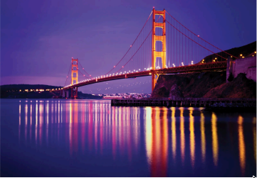

<!-- -------------------------------------------------------- -->
<!-- COVER IMAGE (GitHub-safe version using )            -->
<!-- -------------------------------------------------------- -->
<div style="
    position: relative;
    width: 100%;
    min-height: 520px;
    border-radius: 10px;
    overflow: hidden;
">

  

  <div style="
      position: absolute;
      top: 0; left: 0; right: 0; bottom: 0;
      background-color: rgba(0,0,0,0.45);
  "></div>

  <div style="
      position: absolute;
      top: 30%;
      left: 50%;
      transform: translate(-50%, -50%);
      width: 90%;
      max-width: 900px;
      text-align: center;
      color: white;
      z-index: 2;
  ">
      <div style="font-size: 42px; font-weight: 800; line-height: 1.15;">
          San Francisco Crime Analysis (2018–2025)
      </div>
      <div style="margin-top: 10px; font-size: 22px; font-weight: 500;">
          Exploratory Analysis • Spatial Patterns • Forecasting • Dashboard
      </div>
  </div>

  <div style="
      position: absolute;
      bottom: 40px;
      left: 40px;
      z-index: 2;
      color: white;
      font-size: 15px;
      background-color: rgba(0,0,0,0.45);
      padding: 12px 20px;
      border-radius: 6px;
      line-height: 1.45;
      white-space: nowrap;
  ">
      <strong>Author:</strong> Sileshi Hirpa<br>
      <strong>Course:</strong> DAT 301 (Exploring Data in R & Python)<br>
      <strong>Institution:</strong> Arizona State University<br>
      <strong>Data:</strong> SFPD Incident Reports, DataSF<br>
      <strong>Years:</strong> 2018–2025
  </div>

  <div style="
      position: absolute;
      bottom: 40px;
      right: 40px;
      z-index: 2;
      color: white;
      font-size: 14px;
      font-style: italic;
      text-align: right;
  ">
      Fall 2025
  </div>

</div>

<div style="text-align: center; font-size: 12px; color: gray; margin-top: 6px;">
    Cover Image Source: Britannica — “Golden Gate Bridge”
</div>

---

# 📘 San Francisco Crime Analytics (2018–2025)

A structured, end-to-end analysis of nearly one million SFPD incident reports, covering  
**data cleaning, exploratory visualization, geospatial patterns, time-series forecasting,  
and the development of an interactive Streamlit dashboard.**

This project demonstrates practical analytical workflow skills aligned with business analytics and data science roles.

---

# 📑 Table of Contents

1. [Project Overview](#project-overview)  
2. [Research Goals](#research-goals)  
3. [Dataset](#dataset)  
4. [Repository Structure](#repository-structure)  
5. [Analytical Summary](#analytical-summary)  
    - [Citywide Trend](#1-citywide-trend-2018–2025)  
    - [Neighborhood Hotspots](#2-neighborhood-hotspots)  
    - [Leading Categories](#3-leading-crime-categories)  
    - [Daily and Weekly Patterns](#4-daily-and-weekly-patterns)  
    - [Neighborhood Profiles](#5-neighborhood-crime-profiles)  
    - [Forecasting Early 2026](#6-forecasting-early-2026-sarima)  
    - [Dashboard Features](#7-dashboard-highlights)  
6. [How to Run This Project](#how-to-run-this-project)  
7. [Dashboard Snapshot](#dashboard-snapshot)  
8. [Key Skills Demonstrated](#key-skills-demonstrated)  

---

# Project Overview

This analysis explores crime trends in San Francisco using **2018–2025 SFPD incident data**.  
The work includes:

- detailed data cleaning and feature preparation  
- temporal and spatial exploratory analysis  
- neighborhood-level profiling using DataSF’s **41 Analysis Neighborhoods**  
- category distributions and peak activity patterns  
- SARIMA forecasting for early-2026 trends  
- a local and API-based Streamlit dashboard for interactive exploration  

The project demonstrates practical skills for real-world analytic workflows.

---

# Research Goals

1. Identify which neighborhoods and categories account for the highest activity.  
2. Understand daily and weekly crime rhythms across the city.  
3. Examine multi-year trends from 2018 through 2025.  
4. Build a baseline monthly forecast for early 2026.  
5. Create a dashboard for public-facing and analyst-facing exploration.

---

# Dataset

- **Source:** DataSF Open Data Portal  
- **Dataset:** SFPD Police Incident Reports  
- **Observation window:** 2018–2025  
- **Geography:** DataSF’s standardized **41 Neighborhoods**  

---

# Repository Structure
sfCrimeAnalysis2018-25/
│
├── project2_SH.ipynb # Full analysis notebook
├── project2_SH.html # HTML export
├── app.py # Streamlit dashboard
├── goldenGatebrge.png # Cover image
├── dashboard_charts/ # Dashboard snapshot assets
└── Police_Department_Incident_Reports__2018_to_20251121.csv

---

# Analytical Summary

## 1. Citywide Trend (2018–2025)

Incident volume shows a **marked decline** beginning in 2020,  
stabilizing at lower levels through 2024–2025.

Contributing factors:

- remote and hybrid work  
- reduced commuting and downtown activity  
- shifting tourism patterns  
- public safety initiatives  

San Francisco has entered a **post-2020 baseline** with lower overall incident totals.

---

## 2. Neighborhood Hotspots

Highest-activity neighborhoods:

1. Mission  
2. Tenderloin  
3. South of Market (SoMa)  
4. Financial District / South Beach  
5. Bayview–Hunters Point  

**Lower-activity regions:** Sunset/Parkside, Marina, Outer Richmond, Seacliff.

---

## 3. Leading Crime Categories

Dominant categories include:

- **Larceny Theft**  
- **Malicious Mischief**  
- **Other Miscellaneous**  
- **Assault**  
- **Motor Vehicle Theft**  
- **Burglary**  

These categories define the city's crime distribution across most years.

---

## 4. Daily and Weekly Patterns

### Hourly
- **Quietest:** 4–6 AM  
- **Peak:** 12–3 PM  
- **Evening plateau:** 3–7 PM  
- **Weekend nightlife spike:** midnight–3 AM  

### Weekdays
- **Highest:** Wednesday and Friday  
- **Lowest:** Sunday  

These rhythms reflect worker schedules, nightlife, and tourism cycles.

---

## 5. Neighborhood Crime Profiles

- **Theft-dominant:** Financial District, South Beach, SoMa  
- **Vehicle crime clusters:** Mission, Tenderloin, Bayview  
- **Lower-risk residential:** Sunset, Richmond, Marina  

Each neighborhood shows consistent structural patterns tied to land use.

---

## 6. Forecasting Early 2026 (SARIMA)

A baseline SARIMA model projects:

- **3,900–4,600 incidents per month** early in 2026  
- Roughly **41% lower** than pre-2020 levels  
- Stable and predictable seasonal patterns  

No indication of a return to earlier high-volume years.

---

## 7. Dashboard Highlights

### Full Local Dashboard
Uses all available data (2018–2025). Includes:

- spatial maps  
- hourly & weekday heatmaps  
- category trends  
- neighborhood summaries  
- forecasting visualization  

### API-Based Dashboard
Designed for lighter public use:

- interactive filtering  
- auto-updated visualizations  
- CSV export  

---

# How to Run This Project

## Run Notebook
conda activate py313
streamlit run app.py

```bash
jupyter notebook
# or
jupyter lab
y

