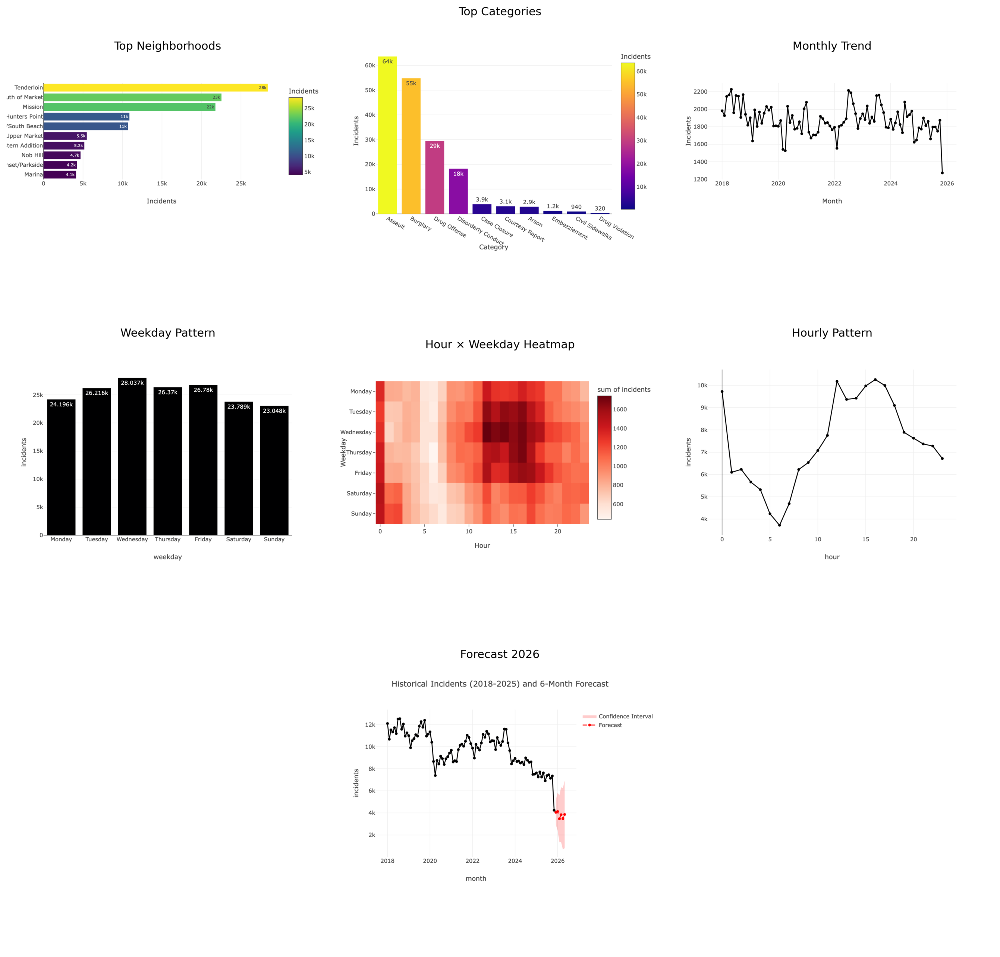

# San Francisco Crime Analytics (2018–2025)
**DAT 301 Project 2 — Exploratory Analysis + Forecasting + Streamlit Dashboard**  
Author: Sileshi Hirpa  
Date: Fall 2025  

---

## Project Overview
This project analyzes San Francisco Police Department incident reports from 2018 through 2025.  
Using Python, I clean and structure the data, explore temporal and neighborhood-based crime patterns, and apply time-series forecasting to estimate short-term trends into early 2026.

In addition to the notebook analysis, the project includes an interactive Streamlit mini-dashboard that allows users to explore crime patterns with real-time filters.

---

## Research Questions
1. Where are incidents most concentrated across analysis neighborhoods?  
2. When do incidents peak across hours and weekdays?  
3. How have incidents changed year-to-year and month-to-month from 2018–2025?  
4. What short-term baseline forecast suggests early-2026 incident levels?  

---

## Data Source
- **Dataset:** SFPD Incident Reports (DataSF Open Data Portal)  
- **Time window:** 2018–2025  
- **Neighborhood standard:** DataSF **41 Analysis Neighborhoods**  

---

## Files Included
- `project2_SH.ipynb` — full analysis notebook  
- `project2_SH.html` — HTML export of notebook  
- `app.py` — Streamlit mini-dashboard  
- `Police_Department_Incident_Reports__2018_to_20251121.csv` — raw/open dataset  

---

## How to Run the Notebook
1. Open Jupyter Lab / Notebook  
2. Run all cells in order  
3. Export HTML after execution  

---

## How to Run the Streamlit Dashboard
From terminal inside the project folder:


## Mini Streamlit Dashboard (Charts Snapshot)

Some of the charts from my Mini-streamlit app are shown below as a single grid for quick review.  
These figures update dynamically in the dashboard based on filters (year range, neighborhood, category, weekday, hour).


```bash

conda activate py313
streamlit run app.py


